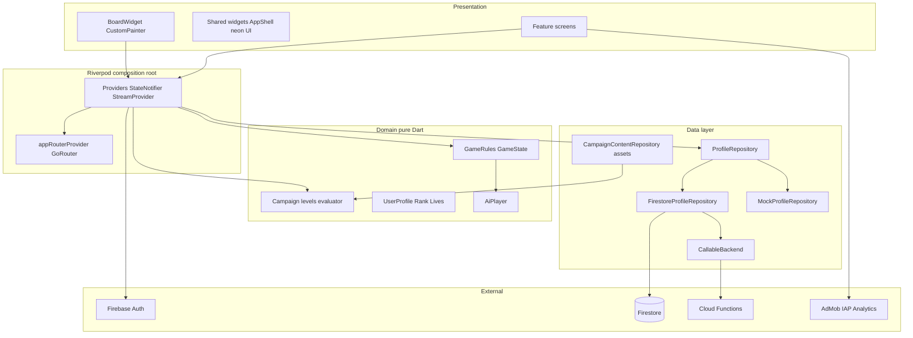
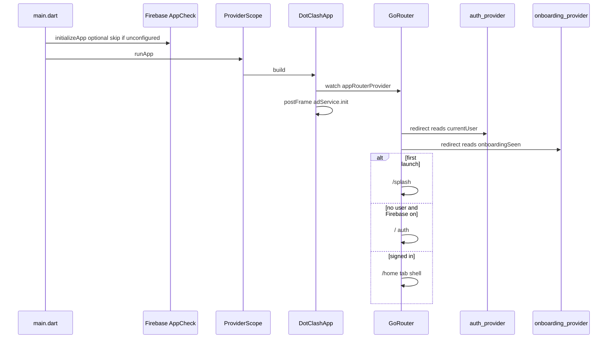
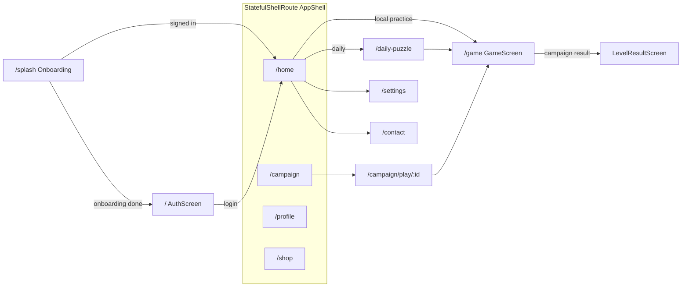
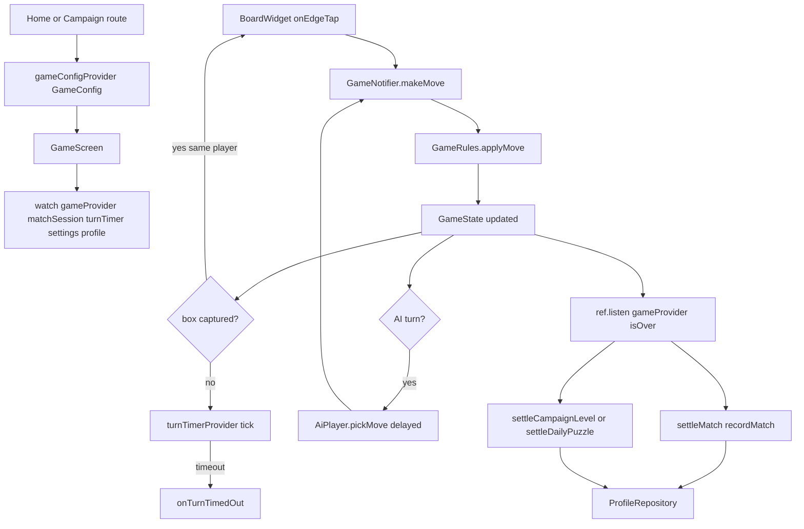
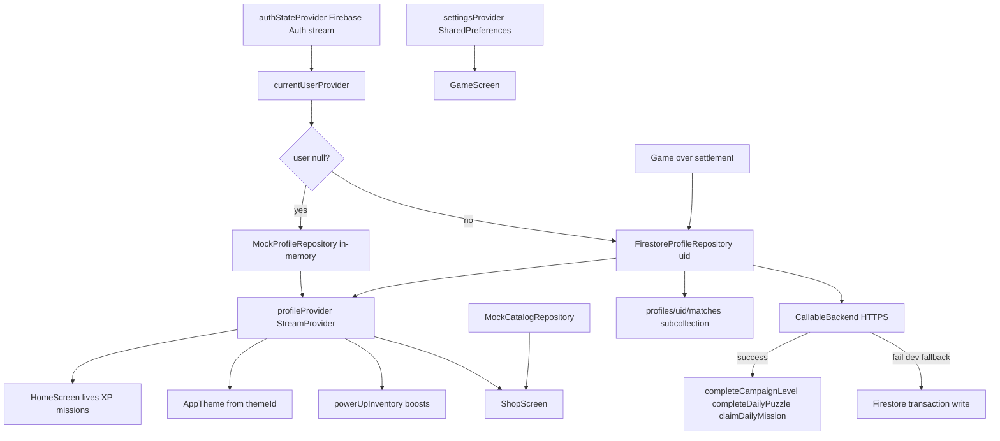
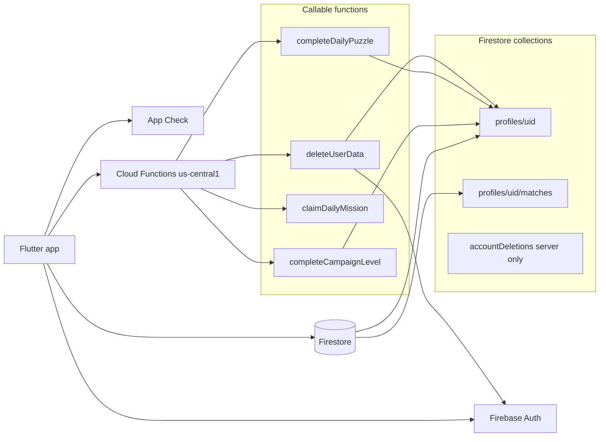
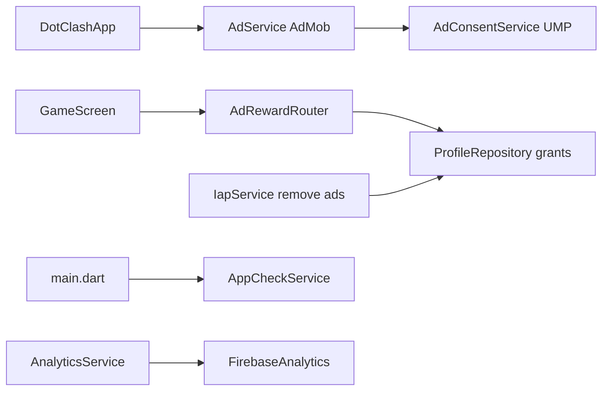
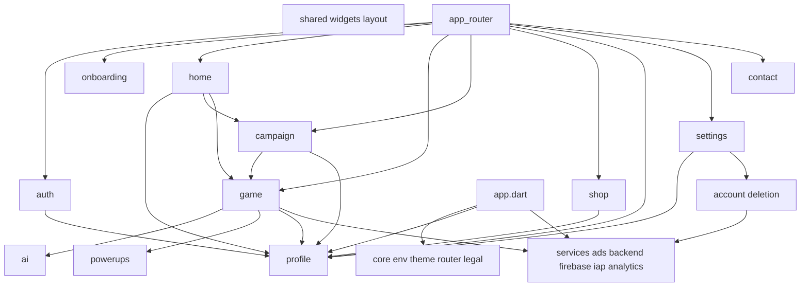

# Dot Clash — Architecture

Connected map of how the Flutter app boots, routes users, runs game logic, and syncs progression. **Gameplay is client-authoritative** (`GameRules` on device). Firebase handles auth, profile, match **history**, and settlement callables. **Online PvP / matchmaking is not implemented** (`lib/features/multiplayer/` is an empty scaffold).

For an interactive version (tabbed graphs, click nodes for file hints), open the Cursor Canvas: `dot-clash-architecture.canvas.tsx` in the IDE canvases panel (beside chat).

---

## How to read this

| Flow type | What to trace |
|-----------|----------------|
| **Control** | `main.dart` → `GoRouter` redirects → screens → `GameNotifier.makeMove` |
| **Data** | `authStateProvider` → `profileRepositoryProvider` → `profileProvider` → UI; game-over → callables or Firestore fallback |
| **Out of scope** | Live board sync, matchmaking, server move validation |

---

## 1. System layers



| Layer | Location | Role |
|-------|----------|------|
| Entry | `lib/main.dart` → `lib/app.dart` | Firebase, App Check, `ProviderScope`, theme from profile |
| Router | `lib/core/router/app_router.dart` | Routes, auth/onboarding redirects |
| Game engine | `lib/features/game/domain/` | Pure rules; no Firebase during moves |
| Profile | `lib/features/profile/` | Repo switch + Firestore/mock |
| Backend | `functions/src/` | Settlement only (no move validation) |

---

## 2. Boot and control flow



**Key control nodes**

- `lib/main.dart` — portrait lock, optional Firebase + Crashlytics
- `lib/app.dart` — `MaterialApp.router`, theme from `profileProvider.themeId`
- `lib/core/router/app_router.dart` — `refreshListenable` merges auth + onboarding refresh
- `lib/shared/widgets/app_shell.dart` — Home, Campaign, Profile, Shop tabs

---

## 3. Navigation graph



**Navigation inputs**

- `context.go` / `context.push` from feature screens
- `GameConfig` via `GoRouterState.extra` or route builder (campaign/daily)
- `gameConfigProvider` updated when `GameScreen` mounts

---

## 4. Game control flow (one match)



| Step | File |
|------|------|
| Rules | `lib/features/game/domain/rules/game_rules.dart` |
| State machine | `lib/features/game/providers/game_provider.dart` (`GameNotifier`) |
| Session meta | `lib/features/game/domain/models/match_session.dart`, `match_session_provider.dart` |
| UI + listeners | `lib/features/game/presentation/game_screen.dart` |
| Board input | `lib/features/game/presentation/widgets/board_widget.dart` |
| AI | `lib/features/ai/ai_player.dart` |

**No Firebase calls** between `makeMove` and game-over listeners.

---

## 5. Data flow (Riverpod + Firebase)



Repository wiring (`lib/features/profile/providers/profile_providers.dart`):

```dart
final profileRepositoryProvider = Provider<ProfileRepository>((ref) {
  final user = ref.watch(currentUserProvider);
  if (user == null) return MockProfileRepository();
  return FirestoreProfileRepository(uid: user.uid);
});
```

Campaign **content** loads from bundled JSON (`assets/campaign/world_*.json`), not Firestore during play.

---

## 6. Firebase backend map



| Callable | Source | Client |
|----------|--------|--------|
| `completeCampaignLevel` | `functions/src/index.ts` | `lib/services/backend/callable_backend.dart` |
| `completeDailyPuzzle` | same | via `firestore_profile_repository.dart` |
| `claimDailyMission` | same | same |
| `deleteUserData` | `functions/src/compliance.ts` | `lib/features/account/data/account_deletion_service.dart` |

---

## 7. Cross-cutting services



---

## 8. Feature module dependencies



---

## 9. Mental model

| Question | Answer |
|----------|--------|
| Where is state? | Riverpod per feature; router in `core/router` |
| Where are moves validated? | `GameRules` only (client) |
| When does Firebase run? | Auth, profile stream, settlement, shop/IAP, analytics |
| Guest vs signed-in? | `MockProfileRepository` vs `FirestoreProfileRepository` |
| Multiplayer? | Not built; `matches` is **history**, not live sync |

---

## File index (key paths)

| Path | Role |
|------|------|
| `lib/main.dart` | Entry: Firebase, App Check, `ProviderScope` |
| `lib/app.dart` | `MaterialApp.router`, ads init, theme from profile |
| `lib/core/router/app_router.dart` | All routes and redirects |
| `lib/core/env/app_env.dart` | Flavor, timers, OAuth client IDs |
| `lib/features/auth/providers/auth_provider.dart` | Auth stream, sign-in actions |
| `lib/features/onboarding/providers/onboarding_provider.dart` | First-launch flag |
| `lib/features/profile/providers/profile_providers.dart` | Repo switch, `profileProvider` |
| `lib/features/profile/data/firestore_profile_repository.dart` | Firestore + callables + match history |
| `lib/features/profile/data/mock_profile_repository.dart` | Guest/offline progression |
| `lib/features/game/providers/game_provider.dart` | `GameNotifier`, turn timer |
| `lib/features/game/domain/rules/game_rules.dart` | Pure game rules |
| `lib/features/game/presentation/game_screen.dart` | Board UI, settlement listeners |
| `lib/features/campaign/data/campaign_content_repository.dart` | Campaign JSON from assets |
| `lib/features/campaign/providers/campaign_providers.dart` | Level loading, progress |
| `lib/features/ai/ai_player.dart` | AI move selection |
| `lib/services/backend/callable_backend.dart` | HTTPS callable wrapper |
| `lib/services/firebase/app_check_service.dart` | App Check activation |
| `lib/services/ads/ad_reward_router.dart` | Rewarded ads → profile grants |
| `functions/src/index.ts` | Campaign/daily/mission callables |
| `functions/src/compliance.ts` | `deleteUserData` |
| `firestore.rules` | Security rules |

---

*Last updated with codebase snapshot (~108 Dart files under `lib/`). Regenerate Canvas graph data when adding major features (e.g. online PvP).*
