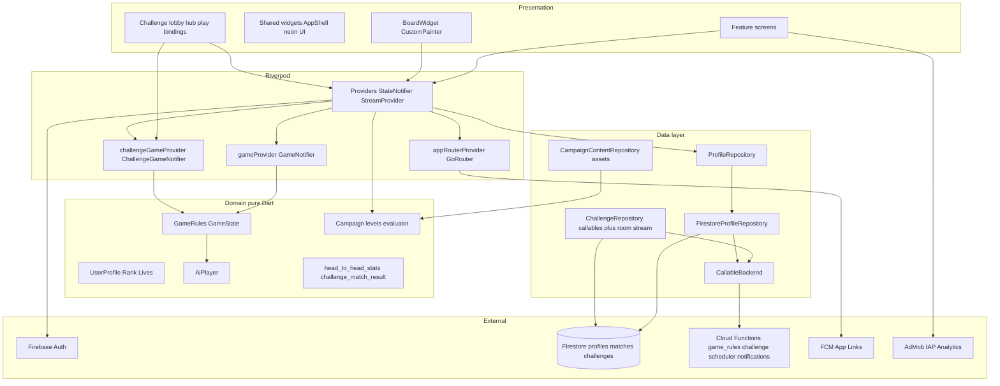
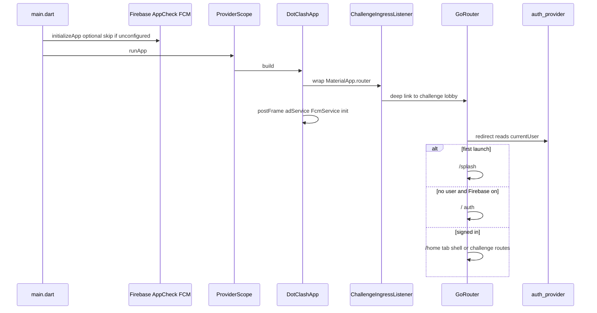
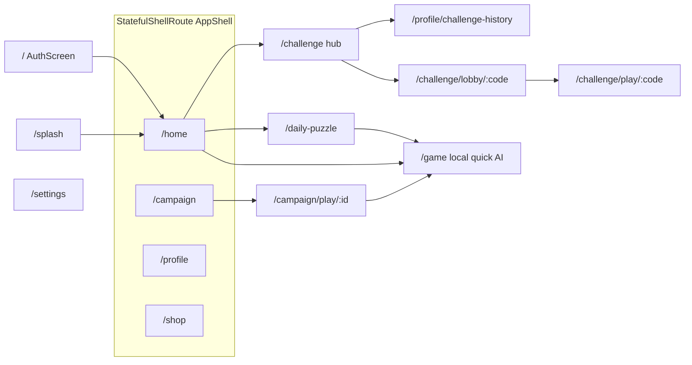
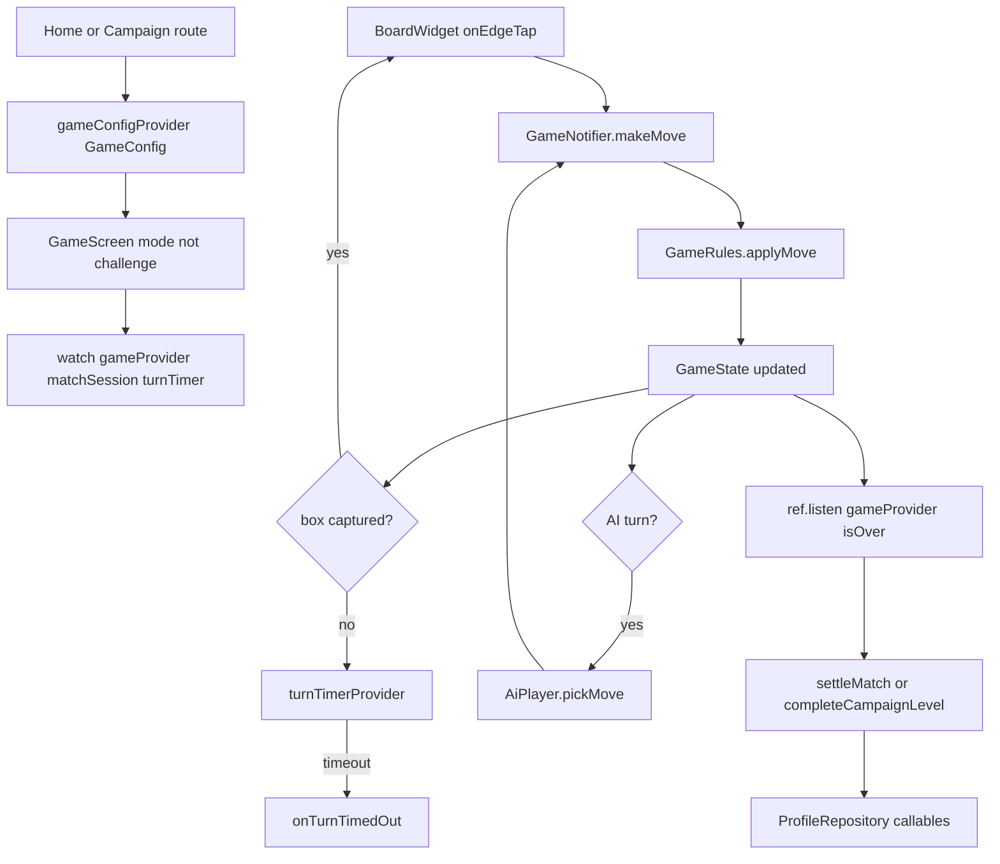
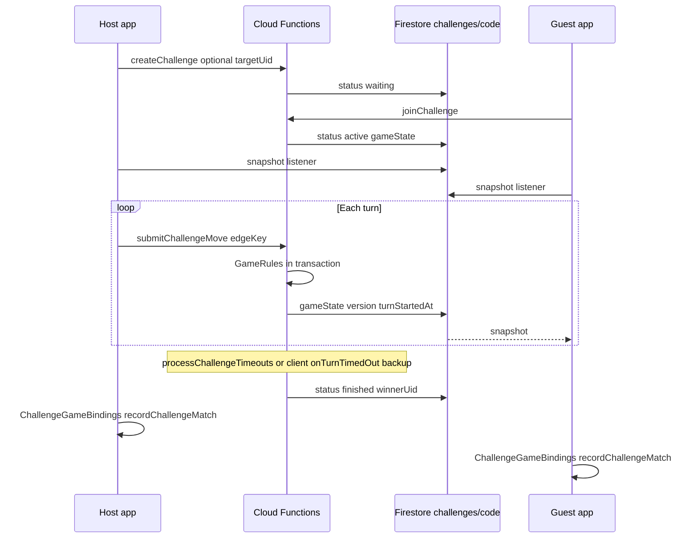
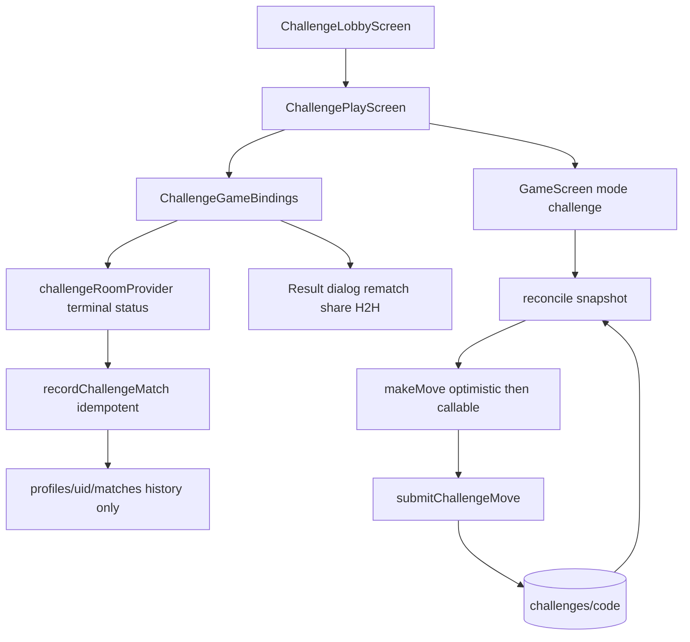
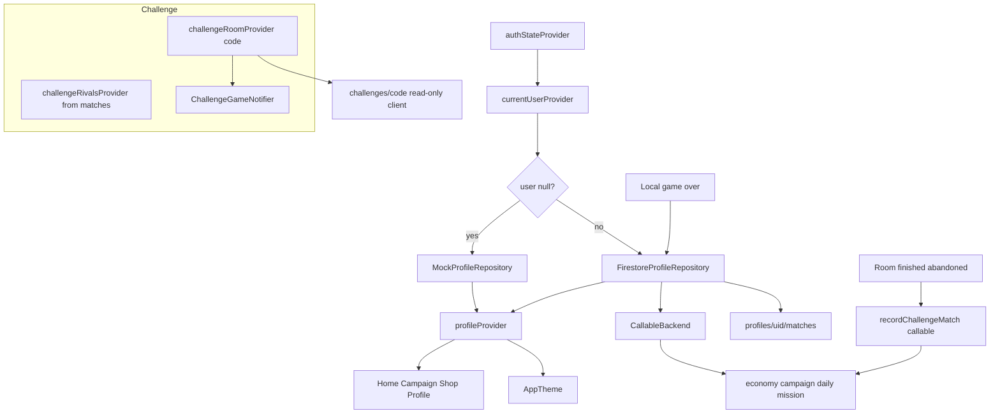
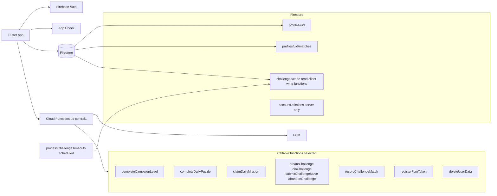
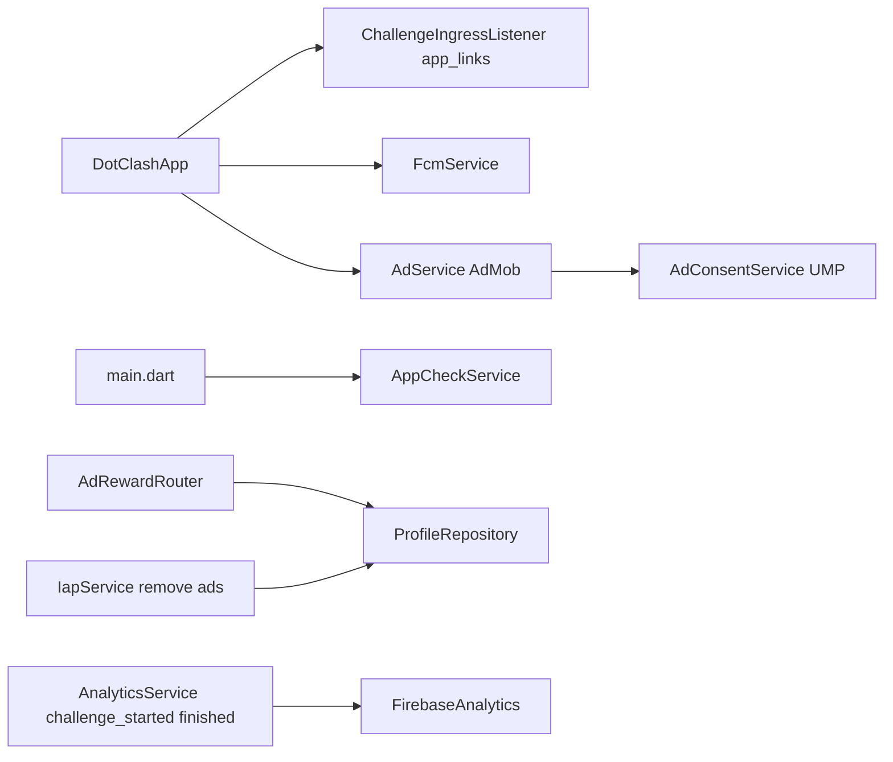
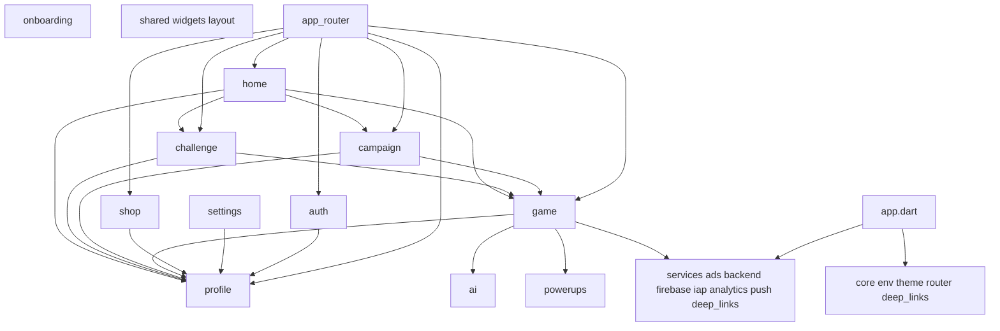

# Dot Clash — Architecture

Connected map of how the Flutter app boots, routes users, runs game logic, and syncs progression.

**Two game backends:**

| Mode | Authority | Sync |
|------|-----------|------|
| **Campaign, Quick Match, Local, Daily** | Client — `GameRules` on device | None (single device) |
| **Challenge a Friend** (build 19+) | Server — `functions/src/game_rules.ts` + callables | Firestore snapshot on `challenges/{code}` |

Campaign economy (coins, XP, lives, missions) flows through settlement callables. **Challenge v1 is history-only** — `recordChallengeMatch` writes match rows, not economy.

`lib/features/multiplayer/` remains an empty scaffold; live 1v1 lives in **`lib/features/challenge/`**.

For session notes and QA history see [summary.md](summary.md). Build tracker: [RELEASES.md](RELEASES.md) (ship by **build number** `+N` in `pubspec.yaml`).

Mermaid diagrams below are the source of truth. Optional: regenerate a Cursor Canvas (`dot-clash-architecture.canvas.tsx`) when major features land.

---

## How to read this

| Flow type | What to trace |
|-----------|----------------|
| **Control (local)** | `main.dart` → `GoRouter` → `GameScreen` → `GameNotifier.makeMove` → `GameRules` |
| **Control (challenge)** | Home → `/challenge` → lobby/play routes → `ChallengeGameNotifier` → `submitChallengeMove` |
| **Data (profile)** | `authStateProvider` → `profileRepositoryProvider` → `profileProvider` → UI |
| **Data (challenge room)** | `challengeRoomProvider(code)` stream → `ChallengeGameNotifier` sync |
| **Settlement (local)** | `gameProvider` listener → `settleMatch` / `completeCampaignLevel` callables |
| **Settlement (challenge)** | `ChallengeGameBindings` on room `finished`/`abandoned` → `recordChallengeMatch` |

---

## 1. System layers



| Layer | Location | Role |
|-------|----------|------|
| Entry | `lib/main.dart` → `lib/app.dart` | Firebase, App Check, FCM background handler, `ProviderScope`, theme |
| Ingress | `lib/services/deep_links/challenge_ingress_listener.dart` | HTTPS / custom scheme / cold start → challenge lobby |
| Router | `lib/core/router/app_router.dart` | Routes, auth/onboarding redirects, challenge path preservation |
| Local game | `lib/features/game/` | Client-authoritative rules; `GameNotifier` |
| Challenge | `lib/features/challenge/` | Server-synced 6×6 PvP; `ChallengeGameNotifier` + bindings |
| Profile | `lib/features/profile/` | Repo switch + Firestore/mock |
| Backend | `functions/src/` | Settlement, economy, **challenge moves**, scheduler, FCM token |

---

## 2. Boot and control flow



**Key control nodes**

- `lib/main.dart` — portrait lock, Firebase + Crashlytics, FCM background handler
- `lib/app.dart` — `MaterialApp.router`, `ChallengeIngressListener`, theme from `profileProvider.themeId`
- `lib/services/push/fcm_service.dart` — permission, `registerFcmToken`, tap → lobby, foreground Android snackbar
- `lib/core/router/app_router.dart` — `refreshListenable` merges auth + onboarding; challenge routes bypass generic `/game`
- `lib/shared/widgets/app_shell.dart` — Home, Campaign, Profile, Shop tabs

---

## 3. Navigation graph



**Challenge routing rules**

- **Never** open live PvP via `/game` + `state.extra` — cold start has no `extra`.
- Path-param routes rebuild `GameConfig.challenge(...)` from Firestore + auth uid (guest = `"B"`).
- Deep links / FCM → `/challenge/lobby/{CODE}` → join → `/challenge/play/{CODE}` when `active`.
- Auth redirect preserves `?next=/challenge/...` after sign-in.

**Local navigation**

- `context.go` / `context.push` from feature screens
- `GameConfig` via `GoRouterState.extra` or route builder (campaign/daily/local only)
- `gameConfigProvider` updated when local `GameScreen` mounts

---

## 4. Game control — local modes (Campaign, Quick Match, Local, Daily)



| Step | File |
|------|------|
| Rules | `lib/features/game/domain/rules/game_rules.dart` |
| State machine | `lib/features/game/providers/game_provider.dart` |
| Session meta | `lib/features/game/domain/models/match_session.dart` |
| UI + listeners | `lib/features/game/presentation/game_screen.dart` (challenge branches gated with `_isChallenge`) |
| Board | `lib/features/game/presentation/widgets/board_widget.dart` |
| AI | `lib/features/ai/ai_player.dart` |

**No Firebase calls** between local `makeMove` and game-over listeners.

---

## 5. Game control — Challenge a Friend (live 1v1)





| Step | File |
|------|------|
| Room model | `lib/features/challenge/domain/challenge_room.dart` |
| Repository | `lib/features/challenge/data/challenge_repository.dart` |
| Live state | `lib/features/challenge/providers/challenge_game_provider.dart` |
| Turn timer | `challengeTurnTimerProvider` (server `turnStartedAt`) |
| Settlement UI | `lib/features/challenge/presentation/challenge_game_bindings.dart` |
| Outcome | `lib/features/challenge/domain/challenge_match_result.dart` (`room.winnerUid`) |
| Hub / rivals | `lib/features/challenge/presentation/challenge_home_screen.dart` |
| Server rules | `functions/src/game_rules.ts` (parity with Dart) |
| Moves + room writes | `functions/src/challenge.ts` (`commitChallengeMoveInTransaction`) |
| Timeouts | `functions/src/challenge_scheduler.ts` (every 1 min) |
| Push | `functions/src/notifications.ts` (recent-rival gate + throttle) |

**Design rules**

- Do **not** add challenge sync to `gameProvider` — separate `ChallengeGameNotifier`.
- `GameScreen` gates local listeners (`matchSession`, campaign settlement, boosts) when `_isChallenge`.
- Challenge settlement listens to **room status**, not local `gameProvider.isOver`.
- `recordChallengeMatch` does not grant coins/XP/lives/rating (history + H2H only).

---

## 6. Data flow (Riverpod + Firebase)



Repository wiring (`lib/features/profile/providers/profile_providers.dart`):

```dart
final profileRepositoryProvider = Provider<ProfileRepository>((ref) {
  final user = ref.watch(currentUserProvider);
  if (user == null) return MockProfileRepository();
  return FirestoreProfileRepository(uid: user.uid);
});
```

Campaign **content** loads from bundled JSON (`assets/campaign/world_*.json`), not Firestore during play.

---

## 7. Firebase backend map



| Callable | Role | Client |
|----------|------|--------|
| `completeCampaignLevel` | Campaign rewards + missions | `firestore_profile_repository.dart` |
| `completeDailyPuzzle` | Daily puzzle coins | same |
| `claimDailyMission` | Mission claim | same |
| `settleQuickMatch` | Quick match economy | same |
| Economy / shop / lives | `economy.ts`, `lives.ts` | shop, game boosts |
| `createChallenge` / `joinChallenge` | Room lifecycle | `challenge_repository.dart` |
| `submitChallengeMove` | Server-validated moves | `ChallengeGameNotifier` |
| `abandonChallenge` | Mid-match leave | `game_screen.dart` |
| `recordChallengeMatch` | Idempotent history (`settledUids`) | `challenge_game_bindings.dart` |
| `registerFcmToken` | Server-written `fcmToken` on profile | `fcm_service.dart` |
| `deleteUserData` | GDPR delete | `account_deletion_service.dart` |
| `processChallengeTimeouts` | Turn timeout, waiting expiry, 24h stale abandon | Scheduler (not client) |

**Security**

- `challenges/{code}`: client **read** if host/guest; **write** denied (functions only) — see `firestore.rules`.
- Profile economy fields: client whitelist; match creates use `validMatchCreate()` with optional `opponentUid`, `challengeCode`.
- Challenge invite push: server checks recent rival history + 60s throttle (`challenge.ts`).

---

## 8. Cross-cutting services



---

## 9. Feature module dependencies



---

## 10. Mental model

| Question | Answer |
|----------|--------|
| Where is state? | Riverpod per feature; router in `core/router` |
| Where are moves validated (local)? | `GameRules` on device |
| Where are moves validated (challenge)? | `game_rules.ts` inside `submitChallengeMove` transaction |
| When does Firebase run? | Auth, profile stream, challenge room stream, settlement, shop/IAP, FCM, analytics |
| Guest vs signed-in? | `MockProfileRepository` vs `FirestoreProfileRepository` |
| Live multiplayer? | **Challenge a Friend** — 1v1, 6×6, not matchmaking |
| Match history? | `profiles/{uid}/matches`; Challenge uses `modeLabel: 'Challenge'` + optional `opponentUid` |
| Rivals / rematch UI? | `ChallengeHomeScreen` + `ChallengeHistoryScreen` (not Profile tab) |
| Build / release naming? | **Build N** (`+N` in `pubspec.yaml`) — see [RELEASES.md](RELEASES.md) |

---

## 11. CI and quality gates

| Gate | Command |
|------|---------|
| Analyze | `flutter analyze --no-fatal-infos` (warnings fail; info debt allowed) |
| Tests | `flutter test` |
| Functions | `cd functions && npm run build && npm run lint` |
| Workflow | `.github/workflows/dart.yml` on `main` PRs |

---

## File index (key paths)

| Path | Role |
|------|------|
| `lib/main.dart` | Entry: Firebase, App Check, FCM background, `ProviderScope` |
| `lib/app.dart` | `MaterialApp.router`, ads + FCM init, `ChallengeIngressListener` |
| `lib/core/router/app_router.dart` | All routes and redirects |
| `lib/core/deep_links/challenge_link_parser.dart` | Parse join codes from URLs |
| `lib/core/env/app_env.dart` | Flavor, timers, OAuth client IDs |
| `lib/features/auth/providers/auth_provider.dart` | Auth stream, sign-in actions |
| `lib/features/game/providers/game_provider.dart` | `GameNotifier` (local modes only) |
| `lib/features/game/presentation/game_screen.dart` | Board UI; dual path for challenge |
| `lib/features/challenge/data/challenge_repository.dart` | Challenge callables + room watch |
| `lib/features/challenge/providers/challenge_game_provider.dart` | `ChallengeGameNotifier` |
| `lib/features/challenge/presentation/challenge_game_bindings.dart` | Terminal room settlement + result dialog |
| `lib/features/challenge/presentation/challenge_home_screen.dart` | Create/join hub + rivalries |
| `lib/features/profile/data/firestore_profile_repository.dart` | Firestore + callables + match history |
| `lib/services/push/fcm_service.dart` | FCM lifecycle + foreground invite UI |
| `lib/services/backend/callable_backend.dart` | HTTPS callable wrapper |
| `functions/src/challenge.ts` | Challenge callables + push gate |
| `functions/src/challenge_scheduler.ts` | Scheduled timeouts + stale abandon |
| `functions/src/game_rules.ts` | Server move validation (Dart parity) |
| `functions/src/notifications.ts` | FCM token + invite send |
| `functions/src/index.ts` | Callable exports |
| `firestore.rules` | Profiles, matches, challenges read model |
| `firestore.indexes.json` | Scheduler queries on `challenges` |

---

*Last updated: 2026-06-13 — build 19 (`1.4.1+19`); ~145 Dart files under `lib/`; Challenge a Friend on `main`.*
